# Personal Search Engine

A privacy-focused, conversational AI-powered search engine that combines SearXNG with AI to deliver intelligent, synthesized results—no search engine API keys required.

This project is for anyone who wants to build a personalized, private search experience, create specialized AI research agents, or simply get straight answers without the noise of the modern web.

## Features

*   **Conversational Search**: Ask questions in natural language and get answers synthesized by a large language model.
*   **Private by Design**: Leverages a self-hosted SearXNG instance to protect your privacy. No tracking, cookies, or profiling.
*   **Local First**: The entire application runs locally on your machine.
*   **Extensible**: The modular design allows for easy extension and customization.
*   **Simple Setup**: Get up and running in minutes with Docker and a few simple commands.

## How It Works

The architecture is straightforward: your terminal interacts with a local Python application, which uses a local SearXNG instance (running in Docker) to fetch private search results. Those results are then synthesized by an AI model to give you a clean, coherent answer.

```mermaid
graph TD
    User["👨‍💻 You (Terminal)"] --> PythonApp["🐍 Python Application (main.py)"]
    subgraph "Local Environment"
        PythonApp -- "Query" --> SearchManager["🔍 SearchEngineManager"]
        SearchManager -- "Fetch Results" --> SearXNG_Client["🔌 SearXNGClient"]
    end
    SearXNG_Client -- "HTTP Request" --> SearXNG_Service["🐳 SearXNG Docker Container"]
    SearXNG_Service -- "Aggregate & Cache" --> Internet["🌐 Real Search Engines"]
    Internet -- "Raw results" --> SearXNG_Service
    SearXNG_Service -- "Clean JSON" --> SearXNG_Client
    SearXNG_Client -- "Parsed Results" --> SearchManager
    SearchManager -- "Synthesize" --> OpenAI_API["☁️ OpenAI API"]
    OpenAI_API -- "Answer" --> PythonApp
    PythonApp -- "Terminal Output" --> User
```



## Quick Start

> **Prerequisites:** Docker, Python 3.8+, and an OpenAI API Key.

```bash
# 1. Clone the repository
git clone https://github.com/your-username/personal-search-engine.git
cd personal-search-engine

# 2. Configure your API key
echo "OPENAI_API_KEY=sk-YOUR_API_KEY_HERE" > .env

# 3. Setup and run
python setup.py && python main.py
```

**Need more help?** For detailed instructions, troubleshooting, and configuration options, check out the [**Developer Guide**](./DEVELOPER_GUIDE.md).

## Future Directions

This project is a solid foundation for a more advanced research agent. Future development could include:

- [ ] **Agentic & Multi-Tool Workflows**: Evolve from a search assistant into a true agent. Grant it the ability to use other tools (like a calculator, code interpreter, or even call other APIs) and autonomously decide which tool to use for a given query.
- [ ] **Personalized Research Profiles**: Allow users to create distinct profiles for different research topics (e.g., "AI Developments," "Market Analysis") that prime the agent with specific contexts, preferred sources, and output formats.
- [ ] **Fully Local & Private AI**: Add first-class support for local LLMs via Ollama, enabling a 100% private, offline-capable version of the search engine.
- [ ] **Deep Research Agent Mode**: Create a mode where the agent can be given a topic to research autonomously. It would periodically search for new information, synthesize findings, and present a summary, acting as a personal intelligence briefing.
- [ ] **Multi-Modal Search**: Extend capabilities to understand and synthesize information from images, videos, and academic papers (PDFs).
- [ ] **Structured Data Extraction & Analysis**: Automatically extract and analyze structured data from web pages, such as tables or financial reports, and allow for direct querying and visualization.
- [ ] **Source Reliability**: Implement a system to automatically assess the reliability and potential bias of sources, providing users with a credibility score or warnings.
- [ ] **Automated Report Generation**: Create comprehensive reports in various formats (e.g., Markdown, PDF, Jupyter Notebooks) complete with citations, summaries, and visualizations.
- [ ] **Trend Analysis & Forecasting**: Monitor topics over time to identify emerging trends, predict future developments, and alert the user to significant changes or new publications.
- [ ] **Argument Mapping**: Deconstruct arguments from sources to identify premises, conclusions, and potential logical fallacies, presenting them in a structured, easy-to-understand format.
- [ ] **Seamless Note-Taking Integration**: Add one-click exporting of findings, summaries, and sources to popular note-taking applications like Obsidian, Logseq, and Notion.
- [ ] **Iterative, Multi-Stage Retrieval**: Implement a system that runs successive, automatically refined searches (keyword → semantic → citation-chaining) to surface high-quality primary sources instead of relying on one-shot queries.
- [ ] **Citation Extraction & Normalization**: Automatically pull canonical identifiers (DOI, arXiv ID, PMID, ISBN) and format them consistently for quick export to reference managers.
- [ ] **Cross-Disciplinary Knowledge Graph**: Connect concepts across different fields to suggest unexpected but relevant literature "bridges" that traditional search engines might miss.
- [ ] **Explainable Summarization**: Produce layered summaries (abstract, deep dive, bullet-point takeaways) with inline citations so users can decide what to read next based on their needs.
- [ ] **Interactive Query Refinement**: Offer smart prompts and visual sliders (date range, study type, source type) to let users steer their research without writing complex search strings.
- [ ] **Progress Tracking & Transparency**: Display a real-time sidebar showing every step of the research process as it happens, allowing users to track progress and understand the agent's reasoning.
- [ ] **Research Canvas & Audio Export**: Add one-click functionality to transform written research reports into interactive visual canvases or narrated audio summaries for different consumption styles.
- [ ] **Auto-Generated Data Visualizations**: Create interactive dashboards and charts from the researched data to help users quickly grasp trends, comparisons, and key metrics.
- [ ] **Self-Reflection Capabilities**: Implement an explicit self-reflection step where the agent evaluates if it has sufficient evidence before drafting conclusions, improving result quality.
- [ ] **Think vs. Instant Modes**: Add toggleable processing modes to let users choose between deeper, more thorough research (with longer wait times) or faster, more immediate results.

Have ideas or suggestions? Open an issue or start a discussion!

---

## Contributing

Found a bug or want to add a feature? We'd love your help! Please see the [**Developer Guide**](./DEVELOPER_GUIDE.md) for details on how to contribute.

---

## License

MIT License - use, modify, and share freely. If this project saves you time or brings you joy, consider dropping a ⭐ on the repository!
