# Personal Search Engine

A privacy-focused, conversational AI-powered search engine that combines SearXNG with AI to deliver intelligent, synthesized results - no search engine API keys required.

Building specialized AI agents for different purposes? That's exactly what this is for. Academic research, social media monitoring, financial analysis, coding assistance—you name it.

*Forget the corporate trackers. Let's make searching fun again.*

 

---

## Why This Project? The Best of Both Worlds

Standard web search is broken. You're fighting SEO garbage, ad-trackers, and outdated answers. This project fixes that by combining the privacy of a meta-search engine with the intelligence of a large language model. You get the best of both worlds.

### The AI Advantage: Intelligent, Context-Aware Answers

This project leverages Large Language Models to transform a messy list of links into a coherent, synthesized answer. Here’s what that AI-driven approach provides:

1.  **Conversational & Context-Aware**: Ask natural follow-up questions. The AI understands the dialogue’s context, refining results with each turn.
2.  **Deep Personalization**: The system learns to adapt to your intent, location, and past behavior, surfacing what truly matters and hiding the noise.
3.  **Higher Relevance with Semantic NLP**: The model understands synonyms, entities, and relationships, so fewer irrelevant links slip through.
4.  **Multimodal Answers**: Text, images, and video are blended into a single, rich panel for more comprehensive discovery.
5.  **Voice-First Accessibility**: Built-in speech recognition and synthesis support hands-free search for drivers, children, or visually impaired users.
6.  **Instant AI Overviews**: Generative snippets summarize multiple pages, saving you time and clicks.
7.  **Proactive Exploration Paths**: The system suggests long-tail topics and new angles you might never have thought to query.
8.  **Faster Time-to-Answer**: By combining semantic retrieval with summarization, the system often returns the exact fact you need in a single step—ideal for mobile or voice queries.
9.  **Continuous Learning**: The model is continuously fine-tuned, allowing it to quickly absorb new jargon, events, and documents.
10. **Intent-Driven Discovery**: For commercial queries, the system can link products directly to user needs, improving the discovery process.

### The Privacy Advantage: Anonymous, Uncensored, & Open Source

This project is built on SearXNG, a battle-tested, open-source metasearch engine that puts your privacy first.

1.  **Strict Privacy**: No tracking, cookies, or profiling. Queries are stateless and stay on your server.
2.  **Meta-Search Breadth**: Aggregates results from ~230 search engines for broader, more comprehensive coverage.
3.  **Total Control**: You can enable or disable specific engines, categories, languages, and time ranges to tune relevance.
4.  **Open Source & Transparent**: The AGPL-3.0 code, issues, and changelog are on GitHub for anyone to audit or improve.
5.  **Self-Host in Minutes**: Official Docker images make it easy to run on a VPS, home lab, or even a Raspberry Pi.
6.  **Lightweight & Fast**: Modest CPU/RAM needs and built-in caching keep it speedy, even on small hardware.
7.  **Advanced Anonymity**: Natively supports Tor routing, HTTP/SOCKS proxies, and result proxying to hide your IP from upstream sites.
8.  **API-Friendly**: Clean JSON endpoints integrate seamlessly with chatbots, research pipelines, and LangChain tools.
9.  **Vibrant Community**: With over 20k stars and thousands of commits, the project is actively maintained with quick bug fixes and new features.
10. **Granular Filtering & UI Tweaks**: Comes with SafeSearch, dark themes, keyboard shortcuts, and category tabs to make daily use pleasant and efficient.

---

## See It in Action

This is what you get—real answers, no tracking, all from your own terminal.

```md

> What are the latest developments in nuclear fusion energy as of late 2025?

As of late 2025, here are some notable developments in nuclear fusion energy:

1. **Commercial Fusion Plant Advances**: Google has entered into an investment and offtake agreement with Commonwealth Fusion Systems for 200 MW of power from its first ARC commercial fusion plant. This represents a significant step towards commercialization of fusion energy.

2. **Breakthrough Results**: There have been record-breaking results related to fusion power, with innovations in compact tokamak designs aimed at producing substantial electricity output, like the proposed ARC reactor, which is designed to produce up to 400 megawatts of electricity.

For more detailed information, you may refer to the articles [here](https://www.world-nuclear-news.org/articles/google-backs-fusion-power) and [here](https://www.scientificamerican.com/article/record-breaking-results-bring-fusion-power-closer-to-reality/).

These developments reflect a growing momentum in the field of nuclear fusion, with significant investments and technological advancements that may lead to practical applications in the near future.
```

---

## Quick Start Guide

> **Prerequisites:** Docker, Python 3.8+, and an OpenAI API Key.

```bash
# 1. Clone the repository
git clone https://github.com/your-username/personal-search-engine.git
cd personal-search-engine

# 2. Configure your API key
echo "OPENAI_API_KEY=sk-YOUR_API_KEY_HERE" > .env

# 3. Setup and run
python setup.py && python main.py
```

**Need more help?** For detailed instructions, troubleshooting, and configuration options, check out the [**Developer Guide**](./DEVELOPER_GUIDE.md).

---

## How It Works

No black boxes here. The architecture is straightforward: your terminal talks to a local Python app, which uses a local SearXNG instance (running in Docker) to fetch private search results. Those results are then synthesized by an AI model to give you a clean, coherent answer.

```mermaid
graph TD
    User["👨‍💻 You, the Terminal Wizard"] --> PythonApp["🐍 The App (main.py)"]
    subgraph "Your Python Realm"
        PythonApp -- "Query" --> SearchManager["🔍 SearchEngineManager"]
        SearchManager -- "Fetch Results" --> SearXNG_Client["🔌 SearXNGClient"]
    end
    SearXNG_Client -- "HTTP Request" --> SearXNG_Service["🐳 SearXNG Docker Container"]
    SearXNG_Service -- "Aggregate & Cache" --> Internet["🌐 Real Search Engines"]
    Internet -- "Raw results" --> SearXNG_Service
    SearXNG_Service -- "Clean JSON" --> SearXNG_Client
    SearXNG_Client -- "Parsed Results" --> SearchManager
    SearchManager -- "Synthesize" --> OpenAI_API["☁️ OpenAI Cloud"]
    OpenAI_API -- "Answer" --> PythonApp
    PythonApp -- "Terminal Output" --> User
```



---

## Comparison: This Project vs. The Alternatives

How does this project stack up against other search APIs and services? Here’s a high-level comparison as of 2025.

| Service               | Privacy Model                                       | Cost / Pricing                                   | Data Control                                 | Self-Hosting        | Key Feature                             | Main Drawback                                   |
| :-------------------- | :-------------------------------------------------- | :----------------------------------------------- | :------------------------------------------- | :------------------ | :-------------------------------------- | :---------------------------------------------- |
| **This Project**      | ✅ **Ultimate** (Local-first, no tracking, proxied) | ✅ **Minimal** (Only your LLM API costs)         | ✅ **Complete Ownership** (All data stays with you) | ✅ **Yes, by Design** | AI Synthesis + Meta-Search Privacy      | Requires initial setup                          |
| **Google Search API** | ❌ **Minimal** (Tied to Google's data ecosystem)    | ❌ **Expensive** ($5/1k queries after free tier) | ❌ **None** (Your data is their product)     | ❌ **No**           | World's largest index                   | Aggressive rate limits, strict ToS              |
| **Brave Search API**  | ✅ **Good** (Privacy-focused index)                 | ⚠️ **Metered** ($5-9/1k queries after free tier)  | ⚠️ **Limited** (Storage rights cost extra)   | ❌ **No**           | Privacy-respecting API                  | Smaller index, licensing concerns               |
| **DuckDuckGo**        | ✅ **Very Good** (No user tracking, but referrer leaks) | ✅ **Free** (Ad-supported)                       | ✅ **Excellent** (No data to control)        | ❌ **No**           | Simple, private search                  | Weaker results, no AI features                  |
| **Perplexity API**    | ⚠️ **Opaque** (Relies on third-party infra)         | ⚠️ **Metered** (Pay-per-API call)                | ❌ **Minimal** (Processed on their servers)  | ❌ **No**           | Conversational answers w/ citations     | Factual accuracy issues, copyright disputes     |
| **Exa API**           | ⚠️ **Opaque** (Third-party service)                | ⚠️ **Metered** (Tiered plans)                    | ⚠️ **Limited** (API-level data access)       | ❌ **No**           | Semantic search for AI (RAG)            | Resource-hungry, integration learning curve   |
| **SerpAPI**           | ⚠️ **Proxy-based** (Scrapes results via proxies)   | ❌ **Expensive** (Pay-per-search, costly at scale) | ⚠️ **Limited** (Templated SERP data)         | ❌ **No**           | Easy SERP scraping                      | Throughput throttles, bot risk                  |

**How to Choose?**

If privacy is paramount, **DuckDuckGo** or **Brave Search** are superior to Google. For programmatic access, **Brave’s API** is cheaper than Google’s but is still maturing. **SerpAPI** is plug-and-play but can be costly at scale. **Exa** shines for RAG experiments but requires more setup. **Perplexity** is fast for exploratory Q&A, but its output requires rigorous fact-checking.

**This project offers a unique alternative:** get the privacy of SearXNG and the power of modern AI without the high costs, data leakage, or usage restrictions of commercial APIs.

---

## The Vision: What's Next?

This project is just the beginning. The goal is to evolve from a simple search assistant into a powerful, proactive research agent. Here are some of the features on the roadmap:


- [ ] **Agentic & Multi-Tool Workflows**: Evolve from a search assistant into a true agent. Grant it the ability to use other tools (like a calculator, code interpreter, or even call other APIs) and autonomously decide which tool to use for a given query.
- [ ] **Personalized Research Profiles**: Allow users to create distinct profiles for different research topics (e.g., "AI Developments," "Market Analysis") that prime the agent with specific contexts, preferred sources, and output formats.
- [ ] **Fully Local & Private AI**: Add first-class support for local LLMs via Ollama, enabling a 100% private, offline-capable version of the search engine.
- [ ] **Deep Research Agent Mode**: Create a mode where the agent can be given a topic to research autonomously. It would periodically search for new information, synthesize findings, and present a summary, acting as a personal intelligence briefing.
- [ ] **Multi-Modal Search**: Extend capabilities to understand and synthesize information from images, videos, and academic papers (PDFs).
- [ ] **Structured Data Extraction & Analysis**: Automatically extract and analyze structured data from web pages, such as tables or financial reports, and allow for direct querying and visualization.
- [ ] **Source Reliability**: Implement a system to automatically assess the reliability and potential bias of sources, providing users with a credibility score or warnings.
- [ ] **Automated Report Generation**: Create comprehensive reports in various formats (e.g., Markdown, PDF, Jupyter Notebooks) complete with citations, summaries, and visualizations.
- [ ] **Trend Analysis & Forecasting**: Monitor topics over time to identify emerging trends, predict future developments, and alert the user to significant changes or new publications.
- [ ] **Argument Mapping**: Deconstruct arguments from sources to identify premises, conclusions, and potential logical fallacies, presenting them in a structured, easy-to-understand format.
- [ ] **Seamless Note-Taking Integration**: Add one-click exporting of findings, summaries, and sources to popular note-taking applications like Obsidian, Logseq, and Notion.
- [ ] **Iterative, Multi-Stage Retrieval**: Implement a system that runs successive, automatically refined searches (keyword → semantic → citation-chaining) to surface high-quality primary sources instead of relying on one-shot queries.
- [ ] **Citation Extraction & Normalization**: Automatically pull canonical identifiers (DOI, arXiv ID, PMID, ISBN) and format them consistently for quick export to reference managers.
- [ ] **Cross-Disciplinary Knowledge Graph**: Connect concepts across different fields to suggest unexpected but relevant literature "bridges" that traditional search engines might miss.
- [ ] **Explainable Summarization**: Produce layered summaries (abstract, deep dive, bullet-point takeaways) with inline citations so users can decide what to read next based on their needs.
- [ ] **Interactive Query Refinement**: Offer smart prompts and visual sliders (date range, study type, source type) to let users steer their research without writing complex search strings.
- [ ] **Progress Tracking & Transparency**: Display a real-time sidebar showing every step of the research process as it happens, allowing users to track progress and understand the agent's reasoning.
- [ ] **Research Canvas & Audio Export**: Add one-click functionality to transform written research reports into interactive visual canvases or narrated audio summaries for different consumption styles.
- [ ] **Auto-Generated Data Visualizations**: Create interactive dashboards and charts from the researched data to help users quickly grasp trends, comparisons, and key metrics.
- [ ] **Self-Reflection Capabilities**: Implement an explicit self-reflection step where the agent evaluates if it has sufficient evidence before drafting conclusions, improving result quality.
- [ ] **Think vs. Instant Modes**: Add toggleable processing modes to let users choose between deeper, more thorough research (with longer wait times) or faster, more immediate results.

Have ideas or suggestions? Open an issue or start a discussion!

---

## Contributing

Found a bug or want to add a feature? We'd love your help! Please see the [**Developer Guide**](./DEVELOPER_GUIDE.md) for details on how to contribute.

---

## License

MIT License - use, modify, and share freely. If this project saves you time or brings you joy, consider dropping a ⭐ on the repository! 